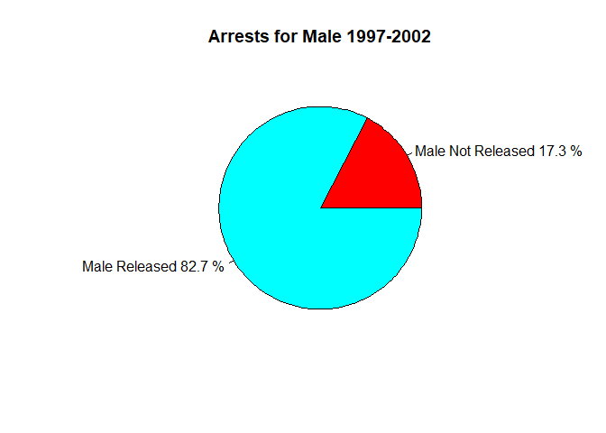
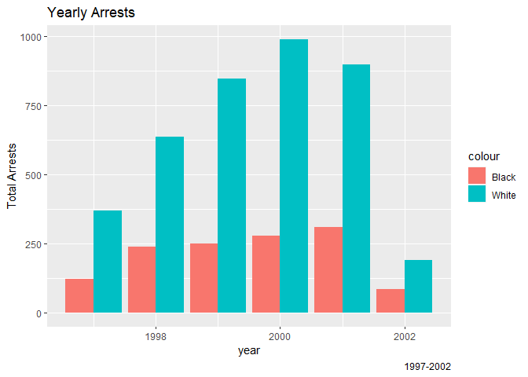
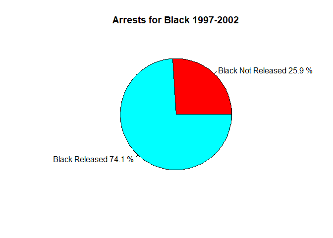
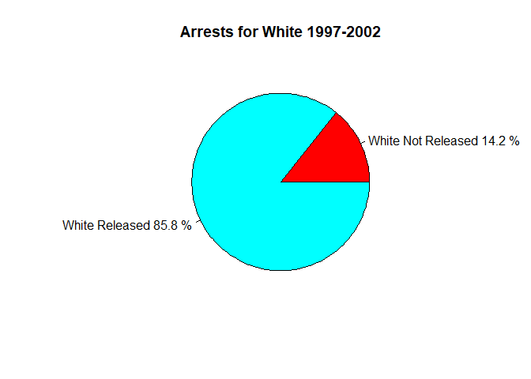

Toronto Marijuana Arrests 1997-2002.
================
EricMulaa
2023-05-09

``` r
mainfolder <- "C:/Users/Admin/OneDrive/Documents/Gthub_Projects/R-Programming/data/"
setwd(mainfolder)
arrests <- read.table(file = "Arrests.csv", header = TRUE, sep = ",")
```

I will have a look at the data I am dealing with

``` r
head(arrests)
```

    ##   X released colour year age    sex employed citizen checks
    ## 1 1      Yes  White 2002  21   Male      Yes     Yes      3
    ## 2 2       No  Black 1999  17   Male      Yes     Yes      3
    ## 3 3      Yes  White 2000  24   Male      Yes     Yes      3
    ## 4 4       No  Black 2000  46   Male      Yes     Yes      1
    ## 5 5      Yes  Black 1999  27 Female      Yes     Yes      1
    ## 6 6      Yes  Black 1998  16 Female      Yes     Yes      0

``` r
summary(arrests)
```

    ##        X          released            colour               year     
    ##  Min.   :   1   Length:5226        Length:5226        Min.   :1997  
    ##  1st Qu.:1307   Class :character   Class :character   1st Qu.:1998  
    ##  Median :2614   Mode  :character   Mode  :character   Median :2000  
    ##  Mean   :2614                                         Mean   :2000  
    ##  3rd Qu.:3920                                         3rd Qu.:2001  
    ##  Max.   :5226                                         Max.   :2002  
    ##       age            sex              employed           citizen         
    ##  Min.   :12.00   Length:5226        Length:5226        Length:5226       
    ##  1st Qu.:18.00   Class :character   Class :character   Class :character  
    ##  Median :21.00   Mode  :character   Mode  :character   Mode  :character  
    ##  Mean   :23.85                                                           
    ##  3rd Qu.:27.00                                                           
    ##  Max.   :66.00                                                           
    ##      checks     
    ##  Min.   :0.000  
    ##  1st Qu.:0.000  
    ##  Median :1.000  
    ##  Mean   :1.636  
    ##  3rd Qu.:3.000  
    ##  Max.   :6.000

``` r
str(arrests)
```

    ## 'data.frame':    5226 obs. of  9 variables:
    ##  $ X       : int  1 2 3 4 5 6 7 8 9 10 ...
    ##  $ released: chr  "Yes" "No" "Yes" "No" ...
    ##  $ colour  : chr  "White" "Black" "White" "Black" ...
    ##  $ year    : int  2002 1999 2000 2000 1999 1998 1999 1998 2000 2001 ...
    ##  $ age     : int  21 17 24 46 27 16 40 34 23 30 ...
    ##  $ sex     : chr  "Male" "Male" "Male" "Male" ...
    ##  $ employed: chr  "Yes" "Yes" "Yes" "Yes" ...
    ##  $ citizen : chr  "Yes" "Yes" "Yes" "Yes" ...
    ##  $ checks  : int  3 3 3 1 1 0 0 1 4 3 ...

I will start by loading a few packages that I will use for this analysis

``` r
library(tidyverse)
```

    ## ── Attaching core tidyverse packages ──────────────────────── tidyverse 2.0.0 ──
    ## ✔ dplyr     1.1.2     ✔ readr     2.1.4
    ## ✔ forcats   1.0.0     ✔ stringr   1.5.0
    ## ✔ ggplot2   3.4.2     ✔ tibble    3.2.1
    ## ✔ lubridate 1.9.2     ✔ tidyr     1.3.0
    ## ✔ purrr     1.0.1     
    ## ── Conflicts ────────────────────────────────────────── tidyverse_conflicts() ──
    ## ✖ dplyr::filter() masks stats::filter()
    ## ✖ dplyr::lag()    masks stats::lag()
    ## ℹ Use the conflicted package (<http://conflicted.r-lib.org/>) to force all conflicts to become errors

``` r
library(ggplot2)
```

I will convert release, colour, sex, employed and citizen columns into
factor objects

``` r
arrests$released <- as.factor(arrests$released)
arrests$colour <- as.factor(arrests$colour)
arrests$sex <- as.factor(arrests$sex)
arrests$citizen <- as.factor(arrests$citizen)
arrests$employed <- as.factor(arrests$employed)
```

let’s see arrests by sex

``` r
arrests %>%
  group_by(sex) %>%
  count()
```

    ## # A tibble: 2 × 2
    ## # Groups:   sex [2]
    ##   sex        n
    ##   <fct>  <int>
    ## 1 Female   443
    ## 2 Male    4783

Between 1997 and 2002 there were 443 female arrests and 4783 male
arrests

``` r
arrests %>%
  group_by(sex, year) %>%
  count() %>%
  arrange(desc(n))
```

    ## # A tibble: 12 × 3
    ## # Groups:   sex, year [12]
    ##    sex     year     n
    ##    <fct>  <int> <int>
    ##  1 Male    2000  1165
    ##  2 Male    2001  1118
    ##  3 Male    1999   999
    ##  4 Male    1998   782
    ##  5 Male    1997   460
    ##  6 Male    2002   259
    ##  7 Female  2000   105
    ##  8 Female  1999   100
    ##  9 Female  1998    95
    ## 10 Female  2001    93
    ## 11 Female  1997    32
    ## 12 Female  2002    18

We can see that most male and female got arrested in 2000 with 1165
arrests for male and 105 for female. 2002 had the least arrests for both
categories

Arrests grouped by sex visualization for female

``` r
female <- arrests %>%
  filter(sex == "Female") %>%
  group_by(released) %>%
  count()
f <- female$n
percentage <- round(100*f/sum(f), 0.5)
lb <- c("Female Not Released", "Female Released")
lb1 <- paste(lb, percentage, "%", sep = " ")
pie(percentage, labels = lb1, main = "Arrests for Female 1997-2002", col = rainbow(length(percentage)))
```

<!-- -->
Out of the total arrests for female year 1997-2002, 14.2% were not
released.

Arrests grouped by sex visualization for male

``` r
male <- arrests %>%
  filter(sex == "Male") %>%
  group_by(released) %>%
  count()
m <- male$n
percents <- round(100*m/sum(m), 0.5)
l <- c("Male Not Released", "Male Released")
l1 <- paste(l, percents, "%", sep = " ")
pie(percents, labels = l1, main = "Arrests for Male 1997-2002", col = rainbow(length(percents)))
```

<!-- -->
Out of the total arrests for male category year 1997-2002, 17.3% were
not released.

let’s see arrests by year

``` r
yearly_arrests <- arrests%>%
  group_by(year, colour) %>%
  count()
ggplot(yearly_arrests, aes(x = year, y = n, fill = colour)) + 
  geom_bar(stat = "identity", position = "dodge")+ 
  labs(title = "Yearly Arrests", caption = "1997-2002", y = "Total Arrests")
```

<!-- -->
2000 saw the most arrests for white, while the most arrests for black
was in 2001

Let’s see total arrests grouped by colour

``` r
arrests %>%
  group_by(colour) %>%
  count()
```

    ## # A tibble: 2 × 2
    ## # Groups:   colour [2]
    ##   colour     n
    ##   <fct>  <int>
    ## 1 Black   1288
    ## 2 White   3938

Total arrests from 1997 to 2002 for white were 3938 while black had 1288
arrests

Let’s see total arrests and releases grouped by colour

``` r
arrests %>%
  group_by(colour, released) %>%
  count()
```

    ## # A tibble: 4 × 3
    ## # Groups:   colour, released [4]
    ##   colour released     n
    ##   <fct>  <fct>    <int>
    ## 1 Black  No         333
    ## 2 Black  Yes        955
    ## 3 White  No         559
    ## 4 White  Yes       3379

I will visualize this, I will start by visualizing black arrests

``` r
piex <- arrests %>%
  filter(colour == "Black") %>%
  group_by(released) %>%
  count()
x <- piex$n
perc <- round(100*x/sum(x), 0.5)
lbl <- c("Black Not Released", "Black Released")
lbl1 <- paste(lbl, perc, "%", sep = " ")
pie(perc, labels = lbl1, main = "Arrests for Black 1997-2002", col = rainbow(length(perc)))
```

<!-- -->
From the above piechart we can see that from the total arrests for black
people 74.1% were released while 25.9% were not released

White arrests

``` r
piey <- arrests %>%
  filter(colour == "White") %>%
  group_by(released) %>%
  count()
y <- piey$n
perct <- round(100*y/sum(y), 0.5)
lbl2 <- c("White Not Released", "White Released")
lbl3 <- paste(lbl2, perct, "%", sep = " ")
pie(perct, labels = lbl3, main = "Arrests for White 1997-2002", col = rainbow(length(perc)))
```

<!-- -->
From the above piechart we can see that out of the total arrest for
white people 85.8% were released while 14.2% were not released.
